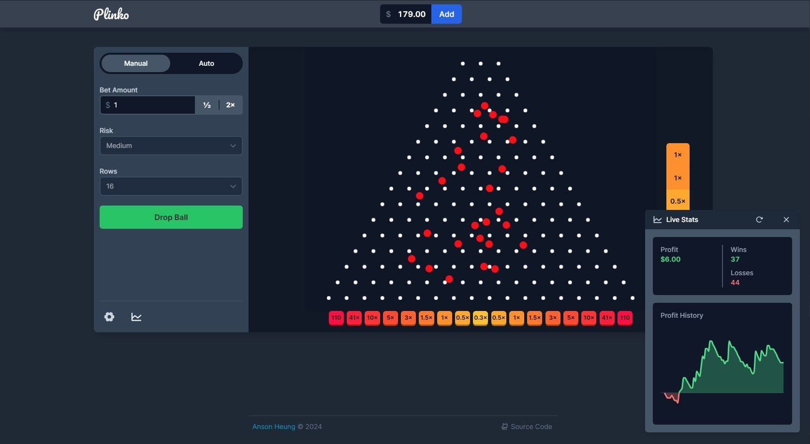
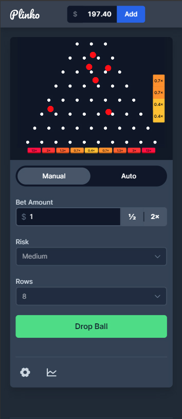
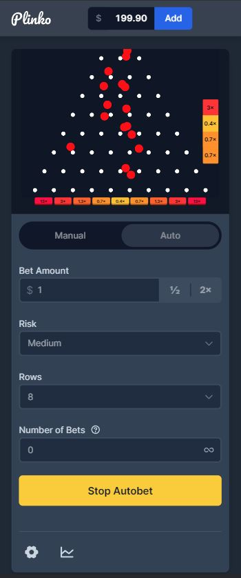

<div align="center">
  
  <h1>plinko-game</h1>
  <p>A web Plinko game inspired by Stake.com's Plinko game.</p>
  <p>Play now 👉 <a href="https://plinko-web-game.netlify.app/" target="_blank" rel="noreferrer">https://plinko-web-game.netlify.app/</a></p>
  
</div>

## About

Plinko is a classic game where the player drops a ball in a multi-row pin pyramid, where the ball bounces randomly until it reaches the payout bins at the bottom.

This project is a replication of [Stake.com's Plinko game](https://stake.com/casino/games/plinko), created using [Svelte](https://svelte.dev/), [Tailwind CSS](https://tailwindcss.com/), and [matter-js](https://github.com/liabru/matter-js). This website is a fun personal project to learn Svelte, and it is not affiliated with Stake.com in any way. I don't encourage gambling, so that's why I created a free-to-play version of the game.

### This project is NON-PROFIT

Please do NOT send me emails or invitations asking me to implement a Plinko game for your company or personal portfolio. This project is for personal hobby only. It is NOT a promotion, and I will decline any freelance invitations.

Feel free to fork this project on your own if you want to build on top of it.

## Features

- 🤑 100% free to play, add money at any time (~~not another crypto scam~~)
- 🤖 Manual and auto-bet modes
- 📊 Real-time live stats
- 📱 Responsive design

## Development

### Getting Started

> [!NOTE]
> Requires Node.js 20 or later.

1. Install [pnpm](https://pnpm.io/installation) version 9 or later
2. Clone this repository
3. Install dependencies

   ```bash
   pnpm install
   ```

4. Start the development server

   ```bash
   pnpm dev
   ```

### Building for Production

The entire site is statically generated using [@sveltejs/adapter-static](https://github.com/sveltejs/kit/tree/main/packages/adapter-static).

1. Generate a static build

   ```bash
   pnpm build
   ```

2. Preview the build site

   ```bash
   pnpm preview
   ```

### Testing

For unit tests, run:

```bash
pnpm test:unit
```

For end-to-end tests powered by [Playwright](https://playwright.dev/):

1. Build for production

   ```bash
   pnpm build
   ```

2. Run the tests

   ```bash
   # Run in UI mode (recommended when writing tests)
   pnpm test:e2e:ui

   # Alternatively, run in headless mode
   pnpm test:e2e
   ```

### Benchmark

A hidden page is only available in local dev environment to benchmark the payout probabilities and expected values. I used this page to tune the parameters of the matter-js physics engine and control the expected payout.

To visit this page, visit the below URL after starting the development server with `pnpm dev`:

```
http://localhost:5173/benchmark
```

## Release

This project uses [Netlify](https://www.netlify.com/) for deployment. To trigger a production deployment, create a commit with message starting with `chore(release)` in the `main` branch.

## More Screenshots

Mobile:

| Manual Mode                             | Auto Mode                               |
| --------------------------------------- | --------------------------------------- |
|  |  |

```
plinko-game-main
├─ .eslintignore
├─ .eslintrc.cjs
├─ .github
│  └─ workflows
│     ├─ deploy.yml
│     └─ test.yml
├─ .gitignore
├─ .npmrc
├─ .prettierignore
├─ .prettierrc
├─ .svelte-kit
│  ├─ ambient.d.ts
│  ├─ generated
│  │  ├─ client
│  │  │  ├─ app.js
│  │  │  ├─ matchers.js
│  │  │  └─ nodes
│  │  │     ├─ 0.js
│  │  │     ├─ 1.js
│  │  │     ├─ 2.js
│  │  │     ├─ 3.js
│  │  │     └─ 4.js
│  │  ├─ root.js
│  │  ├─ root.svelte
│  │  └─ server
│  │     └─ internal.js
│  ├─ non-ambient.d.ts
│  ├─ tsconfig.json
│  └─ types
│     ├─ route_meta_data.json
│     └─ src
│        └─ routes
│           ├─ $types.d.ts
│           └─ benchmark
│              └─ $types.d.ts
├─ README.md
├─ package.json
├─ playwright.config.ts
├─ pnpm-lock.yaml
├─ postcss.config.js
├─ screenshots
│  ├─ desktop-1.jpg
│  ├─ mobile-1.jpg
│  └─ mobile-2.jpg
├─ src
│  ├─ app.css
│  ├─ app.d.ts
│  ├─ app.html
│  ├─ lib
│  │  ├─ assets
│  │  │  ├─ logo.svg
│  │  │  └─ og_image.jpg
│  │  ├─ components
│  │  │  ├─ Balance.svelte
│  │  │  ├─ BinsDistribution.svelte
│  │  │  ├─ LiveStatsWindow
│  │  │  │  ├─ LiveStatsWindow.svelte
│  │  │  │  ├─ Profit.svelte
│  │  │  │  ├─ ProfitHistoryChart.svelte
│  │  │  │  └─ index.ts
│  │  │  ├─ Plinko
│  │  │  │  ├─ BinsRow.svelte
│  │  │  │  ├─ LastWins.svelte
│  │  │  │  ├─ Plinko.svelte
│  │  │  │  ├─ PlinkoEngine.ts
│  │  │  │  └─ index.ts
│  │  │  ├─ SettingsWindow
│  │  │  │  ├─ SettingsWindow.svelte
│  │  │  │  └─ index.ts
│  │  │  ├─ Sidebar
│  │  │  │  ├─ Sidebar.svelte
│  │  │  │  └─ index.ts
│  │  │  └─ ui
│  │  │     ├─ DraggableWindow.svelte
│  │  │     ├─ Select.svelte
│  │  │     ├─ Switch.svelte
│  │  │     └─ index.ts
│  │  ├─ constants
│  │  │  └─ game.ts
│  │  ├─ stores
│  │  │  ├─ game.ts
│  │  │  ├─ layout.ts
│  │  │  └─ settings.ts
│  │  ├─ types
│  │  │  ├─ game.ts
│  │  │  └─ index.ts
│  │  └─ utils
│  │     ├─ __tests__
│  │     │  ├─ colors.test.ts
│  │     │  └─ numbers.test.ts
│  │     ├─ colors.ts
│  │     ├─ game.ts
│  │     ├─ numbers.ts
│  │     ├─ settings.ts
│  │     └─ transitions.ts
│  └─ routes
│     ├─ +layout.svelte
│     ├─ +layout.ts
│     ├─ +page.svelte
│     └─ benchmark
│        ├─ +layout.ts
│        └─ +page.svelte
├─ static
│  ├─ android-chrome-192x192.png
│  ├─ android-chrome-512x512.png
│  ├─ apple-touch-icon.png
│  ├─ favicon-16x16.png
│  ├─ favicon-32x32.png
│  ├─ favicon.ico
│  └─ site.webmanifest
├─ svelte.config.js
├─ tailwind.config.js
├─ tests
│  └─ game.spec.ts
├─ tsconfig.json
└─ vite.config.ts

```